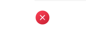

# PCF.OptionSets
Collection of Optionset field controls for Model Driven Apps

## Checkmark Control

Updated version of the [Checkmark Control](https://github.com/BendenBlanken/CheckmarkControl)

This version is a virtual control built using the FluentUI V9 library

There is an option icon Size input to set the pixel size; defaults to 50px if blank.

### Icons

  
  

**CheckmarkCircleColor** (left) | **DismissCircleColor** (right)

---------

 

