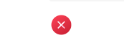

# PCF.OptionSets

Collection of Fluent UI v9 PCF controls for model-driven apps, focused on option set visuals that stay readable, configurable, and easy to adopt.

## Highlights

- Two option-set controls built for model-driven apps.
- Fluent UI v9 styling with a lightweight virtual control approach.
- Configurable icon sizing, icon type, and background fill behavior.

## Overview

This repository contains two related controls designed to make option sets easier to scan and configure in model-driven apps.

| Control | Purpose | Notable options |
| --- | --- | --- |
| Checkmark Control | Displays checkmark and dismiss states with a simple icon-driven layout. | Icon size |
| Optionset Colour | Adds icon and background color treatment for option sets. | Icon size, icon type, background fill |

## Preview

<table>
  <tr>
    <td align="center">
      
       
      <strong>CheckmarkCircleColor</strong>
    </td>
    <td align="center">
      
       
      <strong>DismissCircleColor</strong>
    </td>
  </tr>
</table>

## Table of Contents
- [PCF.OptionSets](#pcfoptionsets)
  - [Highlights](#highlights)
  - [Overview](#overview)
  - [Preview](#preview)
  - [Table of Contents](#table-of-contents)
  - [Checkmark Control](#checkmark-control)
    - [Icons](#icons)
  - [Optionset Colour](#optionset-colour)
    - [Icon Size](#icon-size)
    - [Icon Type](#icon-type)
    - [Background Fill](#background-fill)

## Checkmark Control

Updated version of the [Checkmark Control](https://github.com/BendenBlanken/CheckmarkControl).

This version is a virtual control built using the Fluent UI v9 library.

There is an optional icon size input that sets the pixel size and defaults to 50px if blank.

### Icons

The images above show the two icon states used by the control.

---------

## Optionset Colour

Modified Fluent UI version of the [PCF.ColourfulOptionset](https://github.com/ORBISAG/ORBIS.PCF.ColorfulOptionset).

This control has additional inputs allowing the configuration of:

| Option | Values | Default | Notes |
| --- | --- | --- | --- |
| Icon Size | Small, Medium, Large | Medium (20) | Controls the rendered icon size. |
| Icon Type | CircleFilled, CircleRegular | CircleFilled | Selects the icon style. |
| Background Fill | True, False | False | Uses the option color as the background and removes selection icons. |

### Icon Size

- `Small` (`16`)
- `Medium` (`20`) - Default
- `Large` (`24`)

### Icon Type

- `CircleFilled`
- `CircleRegular`

### Background Fill

Boolean enum property set to false. When true, icons are removed from selection but not from dropdown options, and the background is set to the option color. Text color is set to neutral, allowing dark colors to be used.

---

<table>
  <tr>
    <td align="left">
      
    </td>
    <td align="right">
      
      
    </td>
  </tr>
</table>

